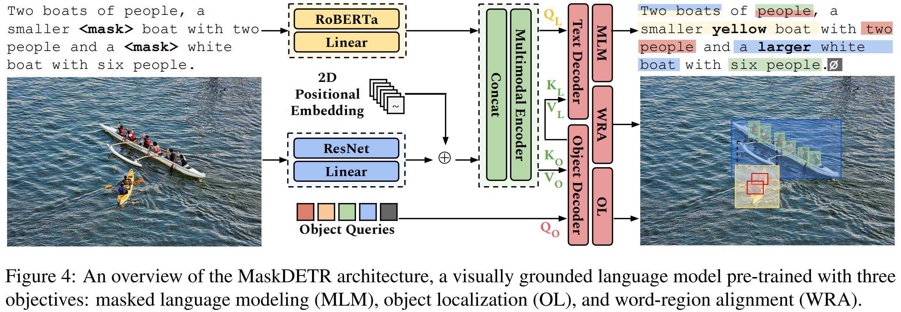

# World-to-Words: Grounded Open Vocabulary Acquisition through Fast Mapping in Vision-Language Models (ACL 2023 Outstanding Paper)

**SLED Lab @ University of Michigan**

 [Paper](https://arxiv.org/abs/2306.08685) • [Model Demo](https://huggingface.co/spaces/sled-umich/OctoBERT) • [Data](https://huggingface.co/datasets/sled-umich/GOVA-flickr)

[Ziqiao Ma](https://mars-tin.github.io/)\*, [Jiayi Pan](https://www.jiayipan.me/)\*, [Joyce Chai](https://web.eecs.umich.edu/~chaijy/) (\* denotes equal contribution)



## Getting Started

You can play with Object-oriented BERT (OctoBERT) through [HuggingFace Space](https://huggingface.co/spaces/sled-umich/OctoBERT) or [Colab](https://colab.research.google.com/drive/1kF-sKoTeXYrNY5bqKGGVcbzqCzOKOjGw#scrollTo=0HxfK6WKe_2P).

Our Grounded Open Vocabulary Acquisition (GOVA) dataset is available on [HuggingFace Dataset](https://huggingface.co/datasets/zma/refcloze).

If you are interested in reproducing our project, please follow the instructions below, which will guide you through the installation, pre-training, inference and evaluation stages.

### Installation

Clone our repository and create the python environment, you can install the required packages by 

```bash
# either
pip install -r requirements.txt
# or after you install pytorch
pip install transformers==4.30 tqdm timm wandb prettytable spacy pycocotools einops scipy
```
### Inference

We release the pre-trained model. You can run the model simply by

```python
import torch
model, img_transform, tokenizer, post_processor, plot_results = torch.hub.load('sled-group/world-to-words', 'flickr_base_model')
```
or access the weights [here](https://huggingface.co/sled-umich/OctoBERT/blob/main/plain_model.pth).

Please follow the instructions in [demo.ipynb](demo.ipynb) to play with our model.

### Pre-training
If you are interested in training the model yourself, please follow the instructions in [Pre-training Instructions](scripts/pretrain/README.md).

### Model Release

To encourage research in developmental machine language acquisition, we release the training trajectory of our model through [HuggingFace Space](https://huggingface.co/spaces/sled-umich/OctoBERT-Trajectories), which include a sequence of checkpoints over time during the pre-training process. 

We will also release a fully developed model through [HuggingFace Space](https://huggingface.co/spaces/sled-umich/OctoBERT), which is pretrained upon the complete grounding dataset of [MDETR](https://github.com/ashkamath/mdetr/blob/main/.github/pretrain.md). Current demo holds a placeholder model. Stay tuned :-)

### Evaluation

The GOVA dataset is available on [HuggingFace Dataset](https://huggingface.co/datasets/sled-umich/GOVA-flickr). We will release instructions for evaluation soon.

## Citation

If you find our work useful, please give us a star and cite as follows :)

```bibtex
@inproceedings{ma-etal-2023-world,
    title = "World-to-Words: Grounded Open Vocabulary Acquisition through Fast Mapping in Vision-Language Models",
    author = "Ma, Ziqiao  and
      Pan, Jiayi  and
      Chai, Joyce",
    booktitle = "Proceedings of the 61st Annual Meeting of the Association for Computational Linguistics (Volume 1: Long Papers)",
    month = jul,
    year = "2023",
    address = "Toronto, Canada",
    publisher = "Association for Computational Linguistics",
    url = "https://aclanthology.org/2023.acl-long.31",
    pages = "524--544",
    abstract = "The ability to connect language units to their referents in the physical world, referred to as grounding, is crucial to learning and understanding grounded meanings of words. While humans demonstrate fast mapping in new word learning, it remains unclear whether modern vision-language models can truly represent language with their grounded meanings, and how grounding may further bootstrap new word learning. To this end, we introduce Grounded Open Vocabulary Acquisition (GOVA) to examine grounding and bootstrapping in open-world language learning. As an initial attempt, we propose World-to-Words (W2W), a novel visually-grounded language model by pre-training on image-text pairs highlighting grounding as an objective. Through extensive experiments and analysis, we demonstrate that W2W is a more coherent and fast grounded word learner, and that the grounding ability acquired during pre-training helps the model to learn unseen words more rapidly and robustly.",
}
```
## Acknowledgement

Our code base is built upon [MDETR](https://github.com/ashkamath/mdetr), [DETR](https://github.com/facebookresearch/detr) and many others. We thank the authors for their great work!

## License

The project is released under the Apache 2.0 license. Please see the [LICENSE](LICENSE) file for more information.
